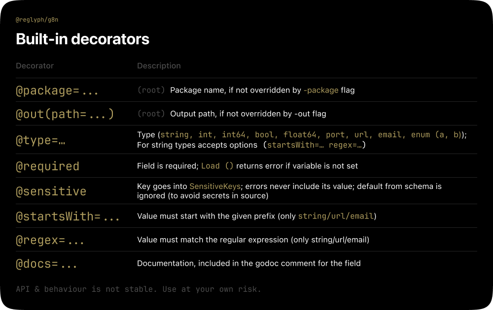
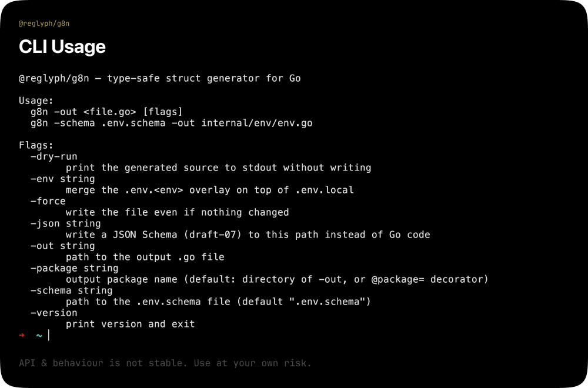
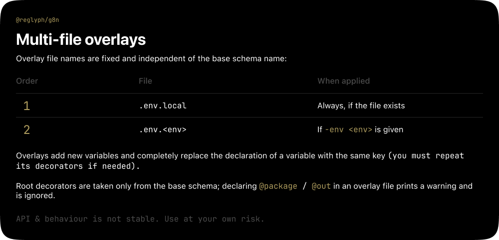

<div align="center">

[](https://github.com/reglyph/g8n/actions/workflows/ci.yml)
[](https://coveralls.io/github/reglyph/g8n)

</div>


```
⚠️ Internal Tool 
This is an internal tool with an unstable API and behavior. 
It is under active development, and breaking changes may occur without notice.

Not recommended for production use until a stable release is tagged. Use at your own risk.
```

Typed environment structure generator for Go based on `.env.schema` file.

Reads the schema, parses it, and generates a self-contained Go file: a typed `Env` struct, a `Load()` function,
validation, and metadata.

## Installation

```bash
# with Homebrew
brew install reglyph/tap/g8n

# or directly from source
go install github.com/reglyph/g8n/cmd/g8n@latest
```

## Usage Example

### 1. Schema file

`example.env.schema` – a full set of decorators:

```envschema
# @package=config
# @out(path=internal/config/env.go)

# Database host
# @type=string @required
DB_HOST=localhost

# @type=port
# @default=5432
DB_PORT=

# @type=enum(dev,staging,prod)
APP_ENV=dev

# Provider API access key
# @required @sensitive
API_KEY=

# @type=bool
DEBUG=false

# @type=url
# @docs=Base URL of the external API
API_BASE_URL=https://api.example.com

# @type=int64
REQUEST_TIMEOUT_MS=5000

# Log level 
# @type=string
LOG_LEVEL=
```



### 2. Generation

```bash
# With flags
g8n -schema example.env.schema -out internal/config/env.go

# OR just g8n (uses the @out decorator from the schema)
g8n
```




### 3. Usage in application code

```go
package main

import (
  "fmt"
  "log"

  "project/internal/config"
)

func main() {
  cfg, err := config.Load()
  if err != nil {
    // Error includes the variable name and schema line 
    log.Fatalf("invalid environment: %v", err)
  }

  fmt.Println("host: ", cfg.DbHost)
}
```

## Validators & expansion

```envschema
# @sensitive @required
# @type=string(startsWith=sk-)   # or separately: # @startsWith=sk-
OPENAI_API_KEY=

# @regex=^[a-f0-9]{32}$
API_TOKEN=

# Reference to another variable in a string value:
API_BASE=https://api.example.com
APP_URL=${API_BASE}/v1

# Unresolved reference stays as is (not turned empty).
KEY=${DOES_NOT_EXIST}
```

Expansion rules:

- String‑typed values (`string`, `url`, `email`, `enum`) are expanded – both from environment and defaults. Numeric and
  boolean types are not expanded: `${...}` in their default is a schema‑parsing error.
- `@sensitive` fields and fields with `@regex` are not expanded (the regex is applied to the raw value).
- A default containing `${...}` bypasses static checks; the final value is validated at `Load()` after substitution. For
  `url`/`email`/`enum`, an invalid (including unresolved) result is a `Load()` error; for string, any string is valid,
  so an unresolved reference remains as is.

Static checks during generation:

- Defaults are validated against type (`int`, `bool`, `float64`, `url`, `email`, `enum`, `port range`); `NaN`/`Inf` for
  `float64` and invalid email are schema errors.
- Numeric and boolean defaults are canonicalised to valid Go literals (`08` → `8`, `TRUE` → `true`).
- Two variables that map to the same Go field name (`DB_HOST` and `db_host` → `DbHost`) cause a generation error.

## Field naming

Env keys are converted to Go identifiers with `naming.GoFieldName`: non‑alphanumeric characters split words, every word
is capitalised (`APP_ENV` → `AppEnv`, `FEATURE_V_2` → `FeatureV2`). Decorative prefixes are not stripped. When the
package name is derived from the output directory it is sanitised, prefixed with `env_` if it starts with a digit, and
a directory that would yield a Go keyword is rejected.

## JSON Schema

With `-json <path>`, `g8n` emits a JSON Schema draft-07 document instead of Go code:

```bash
g8n -schema example.env.schema -json internal/config/env.schema.json
```

The document declares an `object` with one property per variable: `type`, optional `description` (from `@docs`),
`default`, `enum` (from `@type=enum(...)`), `format` (`uri` for `url`, `email` for `email`), `pattern` (from `@regex`)
and numeric `minimum`/`maximum` bounds (for `port`). Variables marked `@required` are listed in `required`.

## License

MIT – see [LICENSE](LICENSE).